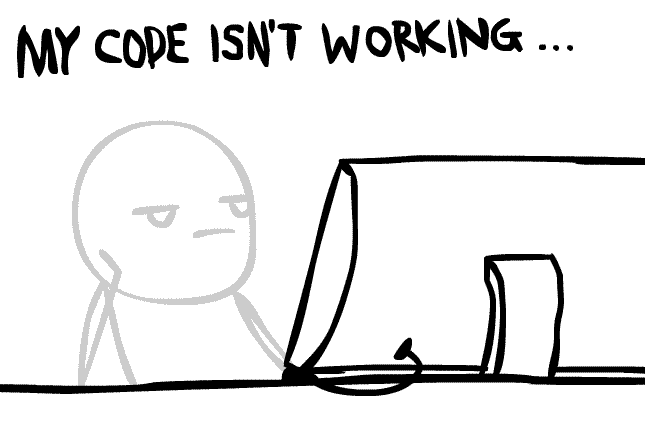

<h1 align="center">Welcome To Quyen Dang Github </h1>
<h2 align="center" id="h2_center">A Passionate Programming And Developer From Viet Nam </h2>

####  Hi, I’m Quyen Dang

#### I'm Quyen Dang, currently I'm a Software Developper , passionate about solving problems with new technology and creating different solutions.

#### 👀 I’m interested in technology

#### 🌱 I’m currently learning about technology like Analyst, Web, App, Data, AI, Service,...

#### 🔭 I’m currently working on Ha Noi

#### 💞️ I’m singled

#### 💬 Ask me about IT, software, how to work better

#### 📫 How to reach me:

#### 🔥 Facebook: https://www.facebook.com/QuyenGiaSuJS/

#### 👍 Instagrams: https://www.instagram.com/quyenutt2000/

#### ✔️ Twitter: https://twitter.com/ngTrnQuyn1

#### ✨ Phone Call: 0337846412

#### 😄 Pronouns: Mr.Quyen

#### ⚡ Fun fact: I like learning forever because I keep learning is addicted 

<!--
**Tran-Quyen/Tran-Quyen** is a ✨ _special_ ✨ repository because its `README.md` (this file) appears on your GitHub profile.
-->

#### Bizness

- :paperclip: [My Resume/CV](Inprocess)
- :email: quyendt2000.software@gmail.com

## Operating systems 💻

## Softwares 🛠

<h3 align="left">Connect with me:</h3>

 

<h3 align="left">Languages and Tools:</h3>

     

          
              

#### Github Gift

#### Github Stats

#### Github Streak

    

#### Github Graph

<!-- https://github.com/Ashutosh00710/github-readme-activity-graph#Deploy-on-your-own-heroku-instance if graph do not load.. -->

    

#### Github Achievements

    

#### Top Languages

   

## Skills 🚀

| Code       | Times          |         Speed Up          | Percent |
| :--------- | :------------- | :-----------------------: | ------: |
| Backend    | 99 hrs 41 mins | ████████████████████▓░░░░ | 82.29 % |
| Frontend   | 90 hrs 50 mins | ████████████████████▓░░░░ | 82.29 % |
| Javascript | 60 hrs 27 mins | ████████████████████▓░░░░ | 82.29 % |
| Other      | 100 hrs        | █████████████████████████ |   100 % |
| Game       | 50 hrs 50 mins | ██████░░░░░░░░░░░░░░░░░░░ | 30.19 % |

## Funny😄

